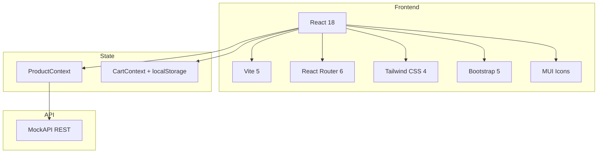

<div align="center">

# 🛒 eKart

### A modern, responsive e-commerce storefront with 3D UI effects

[](https://react.dev/)
[](https://vitejs.dev/)
[](https://tailwindcss.com/)
[](https://mockapi.io/)

**Browse products · Shop with cart · Manage store as admin**

<br />

[🚀 Live Demo](#-deploy-on-vercel) · [⚡ Quick Start](#-quick-start) · [🗺️ Routes](#-routes) · [🤝 Contributing](#-contributing)

<br />


</div>

---

## ✨ About

**eKart** is a full-featured online shopping experience built with **React** and **Vite**. Customers can browse products, filter by category/brand/price, add items to a persistent cart, and explore a polished UI with **3D hover effects**, glass panels, and flip cards. Admins get a dashboard to add, update, and delete products.

> 🔗 **API:** Data is served via [MockAPI](https://mockapi.io/) — no local database setup required.

---

## 🖼️ Preview

> Add screenshots to `docs/screenshots/` and uncomment the lines below.

<!--
<p align="center">
  
  
</p>
-->

<p align="center">
  <i>🏠 Homepage · 🛍️ Product grid · ℹ️ About · 🛒 Cart · 🔐 Admin panel</i>
</p>

---

## 🧩 Features

<details open>
<summary><b>🛍️ Shopper Experience</b></summary>

<br />

| Feature | Description |
|---------|-------------|
| 🏠 **Home** | Hero slider, featured products, contact section |
| 📦 **Products** | Search, filters, sort, 3D product cards |
| 🛒 **Cart** | Add/remove items, quantity, demo checkout |
| ℹ️ **About** | Stats, 3D flip value cards, story section |
| 🔐 **Auth** | User login & signup |
| 📱 **Responsive** | Mobile nav, adaptive grids |

</details>

<details>
<summary><b>🔧 Admin Panel</b></summary>

<br />

| Feature | Description |
|---------|-------------|
| 📊 **Dashboard** | Image carousel overview |
| ➕ **Add Products** | Create listings with image URL |
| ✏️ **Edit / Delete** | Manage inventory via MockAPI |
| 🔑 **Admin Auth** | Separate admin login & signup |

</details>

<details>
<summary><b>🎨 Design & UX</b></summary>

<br />

- Dark theme with brand colors (`#0e1420`, `#eb4235`)
- 3D tilt cards, flip cards, floating hero images
- Glass-morphism panels & ambient background orbs
- Toast notifications for cart & form actions
- Sticky navbar with cart badge

</details>

---

## 🛠️ Tech Stack



| Layer | Technology |
|-------|------------|
| **UI** | React 18, Tailwind CSS 4, Bootstrap, CSS 3D effects |
| **Build** | Vite 5 |
| **Routing** | React Router DOM 6 |
| **HTTP** | Axios |
| **Notifications** | React Toastify |
| **Data** | MockAPI (hosted REST) |
| **Cart** | React Context + `localStorage` |

---

## ⚡ Quick Start

### Prerequisites

- [Node.js](https://nodejs.org/) **v18+**
- [npm](https://www.npmjs.com/) or [yarn](https://yarnpkg.com/)
- [Git](https://git-scm.com/)

### Installation

```bash
# 1. Clone the repository
git clone https://github.com/SKKhatai/Ecommerce.git
cd Ecommerce

# 2. Install dependencies
npm install

# 3. Start development server
npm run dev
```

Open **http://localhost:5173** in your browser.

### Available Scripts

| Command | Description |
|---------|-------------|
| `npm run dev` | Start dev server with hot reload |
| `npm run build` | Create production build in `dist/` |
| `npm run preview` | Preview the production build locally |
| `npm run lint` | Run ESLint |

---

## 🗺️ Routes

| Path | Page |
|------|------|
| `/` | Home — hero, featured products, contact |
| `/userViewProducts` | Product catalog with filters |
| `/singleproduct/:id` | Single product detail |
| `/userCart` | Shopping cart |
| `/userAbout` | About page |
| `/contact` | Contact form |
| `/landing` | Login portal (Admin / Shopper) |
| `/userlogin` | User login |
| `/usersignup` | User signup |
| `/adminlogin` | Admin login |
| `/adminsignup` | Admin signup |
| `/adminhomepage` | Admin dashboard |
| `/adminhomepage/addproducts` | Add new product |
| `/adminhomepage/viewitems` | Manage products |

---

## 📖 Usage

1. Visit the **home page** and browse featured products.
2. Go to **Products** to search, filter, and sort items.
3. Click **Add to Cart** on any product.
4. Open **Cart** to review items and run demo checkout.
5. Use **Login** → **Admin** to manage products in the admin panel.

---

## 🚀 Deploy on Vercel

The fastest way to go live:

[](https://vercel.com/new/clone?repository-url=https://github.com/SKKhatai/Ecommerce)

### Manual steps

1. Push your code to **GitHub**.
2. Import the repo on [vercel.com](https://vercel.com).
3. Use these settings:

| Setting | Value |
|---------|-------|
| Framework | **Vite** |
| Build Command | `npm run build` |
| Output Directory | `dist` |

4. Deploy — your site will be live at `https://your-project.vercel.app`.

> ✅ A `vercel.json` is included so React Router routes work on refresh.

### Environment variables

No `.env` is required — the app uses a public MockAPI endpoint out of the box.

---

## 📁 Project Structure

```
Ecommerce/
├── public/
├── src/
│   ├── Admin/          # Admin pages & dashboard
│   ├── user/           # Shopper pages
│   ├── components/     # ProductTile, TiltCard
│   ├── context/        # Product & Cart providers
│   ├── lib/            # API config
│   ├── styles/         # 3D effects, product cards, homepage
│   └── App.jsx         # Routes & layout
├── vercel.json         # SPA rewrites for Vercel
├── vite.config.js
└── package.json
```

---

## 🤝 Contributing

Contributions are welcome!

```bash
# 1. Fork the repo
# 2. Create a feature branch
git checkout -b feature/amazing-feature

# 3. Commit your changes
git commit -m "Add amazing feature"

# 4. Push and open a Pull Request
git push origin feature/amazing-feature
```

---

## 📬 Contact

**Sourav Khatai**

- 📧 souravkhatai6@gmail.com
- 📱 +91 9777238708
- 📍 Bhubaneswar, Odisha

---

<div align="center">

**⭐ Star this repo if you found it helpful!**

Made with ❤️ using React & Vite

</div>
